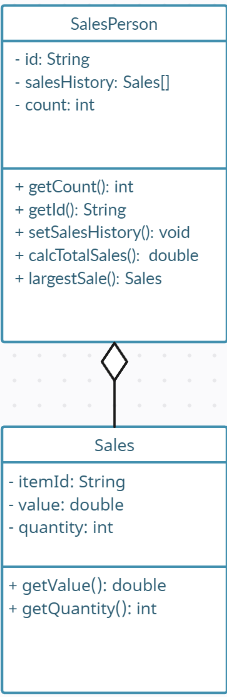

# Forum Week 9 - OOP

Mohammad Sulthan Azka-2609602201-L2AC


**A large company with locations in different cities has taken an OOP approach in creating an administration program that manages all aspects of its business. These aspects include:**

**- the sale of all the different products that the company manages**

**- the salaries for managers, office staff and sales personnel.**


## **1**. 

### (a) **By making use of an example from the above scenario, distinguish between a class and an instantiation of a class.**

*Class*: A class is like a blueprint that defines the characteristics and behaviours of something. For example, in the administration program, a class called "Product" describes what a product is and what it can do.

*Instantiation of a class*: When we create an object based on a class, it's called instantiation. It means we make a real thing using the blueprint. In the administration program, if we create an object from the "Product" class, we make a specific product with its own details, like name, price, and inventory.


### The different modules in the program each open a graphical user interface (GUI). Each GUI has a similar design but contains differences specific to each module.

### (b) **By giving two examples, explain how the principles of inheritance can be incorporated into the design of this administration program.**

*Inheritance*: It's when a class can inherit or get things from another class. Here are two examples in the administration program:

GUI Inheritance: Different modules have similar GUIs with some differences. We can have a basic GUI class that has the common stuff, and each module's GUI can inherit from it and add its own specific features.

Employee Inheritance: In the program, there are different types of employees. We can have a base class called "Employee" with shared attributes, and specific employee types can inherit from it and add their unique characteristics. 


### (c) **Describe how the use of libraries can facilitate the development of programs like this company’s administration program.**

*Libraries*: They are pre-existing tools that make programming easier. Here's how libraries help in the administration program:

Reusability: Libraries provide ready-made code that we can reuse instead of writing everything from scratch. It saves time and effort.

Abstraction: Libraries hide complex details and provide simplified functions to use. We don't need to know how they work internally, just how to use them.

Enhanced Functionality: Libraries offer extra features beyond the programming language's capabilities. For example, they can provide advanced charts or database handling, improving the program's functionality.


### **2. The company employs several sales personnel to sell its products to different retailers. Each branch of the company keeps track of its own sales with a suite of programs that include the two classes SalesPerson and Sales.**

```JAVA
public class SalesPerson {

	// each object contains details of one salesperson

	private String id;

	private Sales[] salesHistory; // details of the different sales

	private int count = 0; // number of sales made


	//constructor for a new salesperson

	public SalesPerson(String id){

	// code missing

	}

 

	// constructor for a salesperson transferred (together with their sales details) from another branch

	public SalesPerson(String id, Sales[] s, int c){

	// code missing

	}

 

	public int getCount(){return count;}

	public String getId() {return id;}

	public void setSalesHistory(Sales s){

	salesHistory[count] = s;

	count = count +1;

	}

 

	public double calcTotalSales(){

	// calculates total sales for the salesperson

	// code missing

	}

 

	public Sales largestSale(){

	// calculates the sale with the largest value

	// code missing

	}

}
```


### **Each instance variable is initialized when a SalesPerson object is instantiated.**

### (a) **Complete the constructor public SalesPerson(String id), from the SalesPerson class.**

```java
public SalesPerson(String id) {
    this.id = id;
    this.salesHistory = new Sales[100]; 
    this.count = 0;
}
```


### (b) **Explain why accessor methods are necessary for the SalesPerson class. (3 points)**

Accessor methods, or getter methods, are important in the SalesPerson class to allow controlled access to its private variables. They enable other classes or methods to retrieve the values of these variables without directly accessing them.


```java
public class Sales {

	// each object contains details of one sale

	private String itemId;     // id of the item

	private double value;      // the price of one item

	private int quantity;      // the number of the items sold

	// constructor missing

	public double getValue() {
        return value;
    }

	public int getQuantity() {
        return quantity;
    }
    
}
```


### (c) (i) **Construct unified modelling language (UML) diagrams to clearly show the relationship between the SalesPerson and Sales classes.**

### Note: There is no need to include mutator or accessor methods or a constructor.




### (c) **(ii) Outline a negative effect that a future change in the design of the Sales object might have on this suite of programs.**

A negative effect of a future change in the design of the Sales object on this suite of programs could be compatibility issues or data inconsistency. If the design of the Sales object is modified, such as changing the data types of itemId, value, or quantity, it may cause errors or produce incorrect results in the existing programs that rely on the previous design.


### **The company employs several sales personnel. The different salesPerson objects are held in the array salesPeople. The Driver class contains various methods that operate on the SalesPerson and Sales classes. The Driver class contains the following code:**

```java
public static void main(String[] args){

    SalesPerson[] salesPeople = new SalesPerson[6];

    salesPeople[0] = new SalesPerson("100");

    salesPeople[1] = new SalesPerson("101");

    salesPeople[2] = new SalesPerson("102");

    salesPeople[0].setSalesHistory(new Sales("A100",300.00,10));

    salesPeople[0].setSalesHistory(new Sales("A200",1000.00,2));

    salesPeople[1].setSalesHistory(new Sales("A300",2550.40,10));

    System.out.println(salesPeople[2].getId());

    System.out.println(salesPeople[0].getCount());

    System.out.println(salesPeople[1].getSalesHistory(0).getValue());

    System.out.println(salesPeople[0].calcTotalSales());

 }
```


### (d) **State the output after running this code.**

```
102
2
2550.4
5000.0
```


### (e) **Construct the method calcTotalSales(), in the SalesPerson class that calculates the total value of the sales for a specific SalesPerson object.**

```java
public double calcTotalSales() {
    double totalSales = 0.0;
    for (int i = 0; i < count; i++) {
        totalSales += salesHistory[i].getValue() * salesHistory[i].getQuantity();
    }
    return totalSales;
}

```


### **The salesPeople array contains 100 instantiated objects. The company wishes to reward the salesperson whose sales have the largest total value.**

### (f) **By making use of any previously written methods, construct the method highest(), that returns the ID of the salesperson whose sales have the largest total value.**

```java
public static String highest(SalesPerson[] salesPeople) {
    double maxTotalSales = 0.0;
    String salesPersonId = "";
    for (SalesPerson salesPerson : salesPeople) {
        double totalSales = salesPerson.calcTotalSales();
        if (totalSales > maxTotalSales) {
            maxTotalSales = totalSales;
            salesPersonId = salesPerson.getId();
        }
    }
    return salesPersonId;
}
```


### (g) **Construct the method addSales(Sales s, String id), in the Driver class, that will add a new Sales object s, to the salesperson with a specified ID.**

##### Note: You can assume that the ID is a valid one.

```java
public static void addSales(Sales s, String id, SalesPerson[] salesPeople) {
    for (SalesPerson salesPerson : salesPeople) {
        if (salesPerson.getId().equals(id)) {
            salesPerson.setSalesHistory(s);
            break;
        }
    }
}

```


### **A further class in this suite of programs is the Payroll class. This class is run at the end of each month to calculate each salesperson’s salary, which is based on the sales that have been made during that month.**

### (h) **Suggest changes that must be made to the SalesPerson class and/or the Sales class to allow these calculations to be made.**

<p>
Add a date variable to the Sales class to store the date of the sale.<br>
Add a method in the Sales class to retrieve the date of the sale. <br>
Modify the SalesPerson class to include a method for calculating the salary based on the sales made during a specific month. This method should consider the date of the sales and filter them accordingly.</p>


### (i) **Discuss the use of polymorphism that occurs in this suite of programs.**

Polymorphism is used in this suite of programs through inheritance and method overriding. It allows for treating SalesPerson objects as Sales objects, enabling code to be written in a more generalized manner. Method overriding allows the SalesPerson class to provide its own implementation of the calcTotalSales() method, adding flexibility and customization to the suite of programs.